# Alpha2048

[TOC]

## 1. 实验任务

### 1.1 实验目的

​		训练一个玩2048的神经网络，并得到较高的准确率。

### 1.2 实验背景

​		2048是一个益智小游戏，规则为：控制所有方块向同一个方向运动，两个相同数字方块撞在一起后合并，成为他们的和。每次操作时会随机生成一个2或者4，最终得到一个“2048”的方块就算胜利。

### 1.3 建模过程

​		2048游戏可以理解为一个这样的过程：

> 有一个**局面（state）**，4x4格子上的一些数字。
>
> 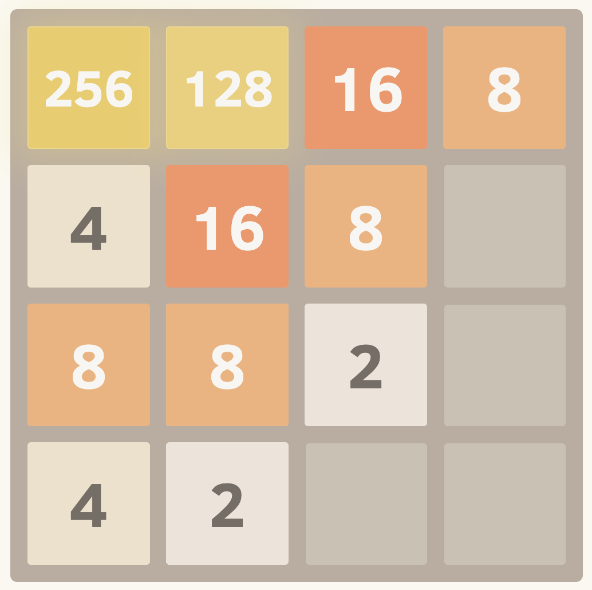
>
> 你可以选择做一些**动作（action）**，比如按键盘上的上/下/左/右键。
>
> 你有一些**策略（policy）**，比如你觉得现在按左最好，因为这样有两个8可以合并。对于每个动作，可以用一个打分函数来决定你的策略。
>
> 在按照策略做完动作之后，你会得到一个**奖励（reward）**，比如因为两个8合并，分数增加了16，这个16可以被看作是这一步的奖励。
>
> 在许多步之后，游戏结束，你会得到一个**回报（return）**，即游戏的最终分数。

​		由此，我们将2048建模为一个马尔可夫决策过程，其求解可以通过各种强化学习方法来完成。

### 1.4 游戏规定

​		在每次做完动作之后，会在空格子上随机生成一个2或者4，其中**出现2的概率是90%**，**出现4的概率是10%**。

​		模型输出结果为0、1、2、3，分别对应于按键盘上的左、上、右、下。

​		得分是指每次相同数字的方块合并后，就将合并后的数字作为该操作的得分，例如两个4合并，分数增加了8。

## 2. 实验方法

### 2.1 输入格式

​		在baseline中定义了输入转化函数`make_input`，使得局面可以被输入进模型。

```python
table = {2**i:i for i in range(1,16)}
table[0] = 0

def make_input(grid):
    g0 = grid
    r = np.zeros(shape=(16, 4, 4), dtype=np.float32)
    for i in range(4):
        for j in range(4):
            v = g0[i, j]
            r[table[v],i, j]=1
    return r
```

​		局面以形状为`(16, 4, 4)`的张量形式传入模型，当`r[value, i, j]=1`时，表明`grid[i, j]=2 ** value`（当`value=0`时，`grid[i, j]=0`）。

### 2.2 Double DQN

#### 2.2.1 DQN的目标Q值计算问题

​		在DDQN之前，基本上所有的目标Q值都是通过贪婪法直接得到的，无论是Q-Learning， DQN（NIPS 2013）还是 Nature DQN，都是如此，下面以DNQ为例进行说明。

​		DNQ（Deep Q Network） 有两个网络，分别是预测网络（predict Q Network）和目标网络（Target Q Network），预测网络用来预测当前状态对应的各个动作的Q值，目标网络用来预测下一个或者下第几个状态各个动作的Q值，这个取决于训练过程采用时间差分（Temporal Difference）还是蒙特卡洛（MC）方法，以TD的训练过程为例，我们期望对采样的每一个状态、动作、奖励元组最小化下式：
$$
(Q(s_j,a_j;\theta)-y_i)^2
$$
​		其中，Q对应的θ即预测网络，它接收当前状态，输出一个当前状态对应各个动作的Q值，然后选取当前动作对应的那个Q值。$y_{i}$是Ground Truth标签，它是由目标网络计算得出：
$$
y_i = \begin{cases}
r_i ~~~~~~~~~~~~~~~~~~~~~~~~~~~~~~~~~~~~~~~~~if ~ epoisode ~ ends ~ at ~ j+1\\
r_i~+~\gamma max_{a'}\hat Q(s_{j+1},a') ~~~otherwise
\end{cases}
$$
​		其中，Q对应的θ即是目标网络。当采取这个动作回合结束，则标签即使这次动作产生的奖励；如果回合未结束，则标签将由两部分构成，第一部分即是这次动作产生的奖励，另一部分则是又目标网络计算、即下一个状态各个动作对应的Q值，然后选取最大的那个Q值。需要注意的是，目标网络的参数设定是不可训练的。在经过M次后，我们会将预测网络被更新的全部参数复制给目标网络，其中M是一个可调参数，避免了震荡。但是使用max虽然可以快速让Q值向可能的优化目标靠拢，但是很容易过犹不及，导致过度估计（Over Estimation），所谓过度估计就是最终我们得到的算法模型有很大的偏差（bias）。为了解决这个问题， DDQN通过解耦目标Q值动作的选择和目标Q值的计算这两步，来达到消除过度估计的问题。

#### 2.2.2  DDQN的算法建模

​		DDQN和DQN一样，也有一样的两个Q网络结构。在Nature DQN的基础上，通过解耦目标Q值动作的选择和目标Q值的计算这两步，来消除过度估计的问题。

​		在上一节里，DQN对于非终止状态，其目标Q值的计算式子是：
$$
y_i = r_i~+~\gamma max_{a'}\hat Q(s_{j+1},a')
$$
​		在DNQ这里，不再是直接在目标Q网络里面找各个动作中的最大Q值，而是现在当前Q网络中找出最大Q值对应的动作，即：
$$
a^{max}(S′_j,w)=argmax_a′Q(s′_j,a,\theta)
$$
​		然后利用这个选择出来的动作$a^{max}(S^{'}_{j}, w)$在目标网络里面去计算目标Q值。即：
$$
y_j=r_j+γQ′(s′_j,a^{max}(s′_j,w),\theta)
$$
​		综合起来写就是：
$$
y_j=r_j+γQ′(s′_j,arg~max_{a'}(s′_j,w),\theta)
$$
​		除了目标Q值的计算方式以外，DDQN算法和DQN的算法流程完全相同。

#### 2.2.3 DDQN算法流程

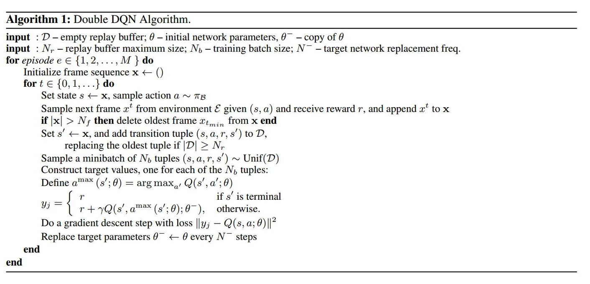

### 2.3 模型介绍

#### 2.3.1 baseline模型

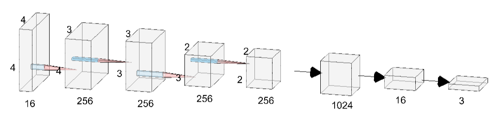

​		baseline采用的模型结构如上图所示。输入的张量形状为(16, 4, 4)，然后经过4次卷积操作，其中卷积核是形状为2 * 1和1 * 2的卷积核交替的。在得到形状为(256, 2, 2)的张量后，再将其展平。最后，通过两个全连接层得到最终的分类概率预测结果。模型中使用的激活函数为ReLU函数，在每次卷积操作和第一层全连接层后，都用ReLU函数进行了处理。

​		模型代码位于`code/model/megvii.py`。

#### 2.3.2 JPCNN

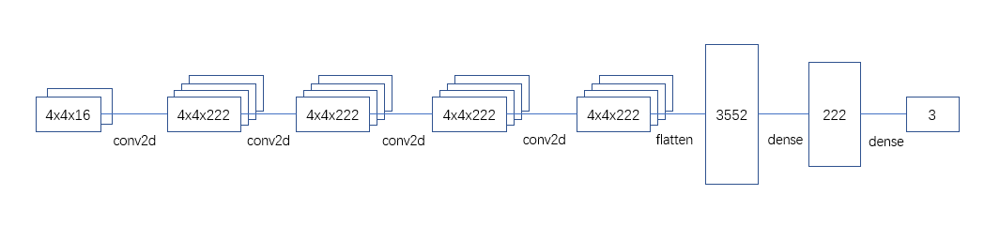

​		模型结构参考自[Playing Game 2048 with Deep Convolutional Neural Networks Trained by Supervised Learning](https://www.jstage.jst.go.jp/article/ipsjjip/27/0/27_340/_article/-char/ja/)，上图为**5层卷积结构**下的模型展示。整个模型的大致结构和计算流程为：

1. 首先，使用2到9个卷积层进行卷积，卷积核的宽度为2 * 2；
2. 然后，将张量展平；
3. 最后，通过两个全连接层获得分类概率的预测结果

​		模型中的激活函数使用ReLU函数。此外，当卷积层的层数不同时，各个卷积层的通道数也有所不同，在论文中提到不同卷积层数与卷积层通道数的对应关系如下表所示。

| 卷积层数 | 卷积层通道数 |
| :------: | :----------: |
|    2     |     436      |
|    3     |     312      |
|    4     |     256      |
|    5     |     222      |
|    6     |     200      |
|    7     |     182      |
|    8     |     168      |
|    9     |     158      |

​		通过在不同层数的模型下进行实验，可以发现5个卷积层的模型具有最好的效果，可以得到更高的平均分数。

​		模型代码位于`code/model/jpcnn.py`

#### 2.3.3 NaiveResNet

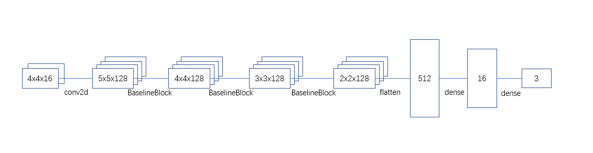

​		模型结构也是以卷积层为主。但区别在于，中间的几层BaselineBlock参考了ResNet的Block结构，通过将几个卷积层前的输入直接（或令通过一个卷积层处理成相同形状）加到这几个卷积层卷积后的结果上，来应对梯度消失与梯度爆炸的问题。

​		对于Block中的卷积层，我们在多种结构下进行了实验，包括：

* 与原先的ResNet的Block一样使用3 * 3的卷积核；
* 与JPCNN一样使用2 * 2的卷积核；
* 与baseline模型一样，交替使用2 * 1的卷积核与1 * 2的卷积核。

​		通过多次试验，我们发现第三种能获得更好的效果，所以最终使用的BaselineBlock的结果如下所示：

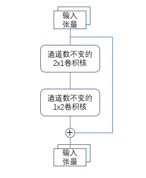

​		输入张量在整个模型的计算流程如下：

1. 首先，经过第一个卷积层
2. 接下来，经过3个BaselineBlock模块
3. 然后，将张量展平
4. 最后，经过2个全连接层得到结果

​		模型代码位于`code/model/naive_resnet.py`。

#### 2.3.4 NavjinNet

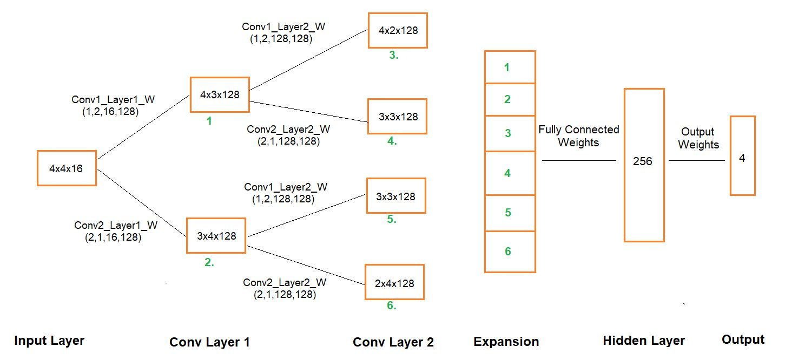

​		在本实验中，根据游戏经验和常规策略，我们对输出层进行了调整，将输出从4维换成3维。

​		在此模型中，使用四组双卷积层处理输入的张量，若加上中间的计算结果，共可得到六个不同的张量。将六个张量展平后再进行拼接，利用全连接神经网络处理拼接后的向量，即可得到最终的分类概率预测结果。该模型通过不同的卷积形状组合得到多个处理结果，不同处理结果对输入张量在两个维度上的特征提取各有侧重，最终降维拼接而得的向量能够较为全面地刻画输入张量，且便于全连接神经网络的处理。

​		模型代码位于`code/model/navjin.py`。

## 3. 实验结果

### 3.1 baseline模型

​		在本实验中，baseline的训练方法是epochs为50000，同时进行32局游戏训练。baseline是在训练的过程中计算平均分数，即在某一epoch时游戏结束，就将该局游戏的分数计入平均分数的计算。并且，baseline关于平均分数的计算方法采用的是滑动平均，可以防止数据的抖动，具体可见以下代码。在之后的实验中，都将采用这种方式计算平均分数。

```python
if avg_score == 0:
	avg_score = game[k].score
else:
    avg_score = avg_score * 0.99 + game[k].score * 0.01
```

​		经过多次实验，我们发现使用相同的模型进行2048游戏，平均分数也会有比较明显的波动。最终，我们进行了10次实验，取其平均数作为baseline模型的平均分数，为**2179.73**分，最高的一次分数为8316。

### 3.2 改良baseline模型

​		经过多次实验，我们发现在原先的训练方法下，模型始终处于欠拟合状态，因此我们将epochs调大至500000，并且让模型同时玩64局游戏进行训练。最终得到的实验结果截图，如下所示。

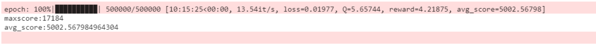

​		通过实验可知，改良baseline模型的平均分数为**5002.57**分，提高至原先的近2.5倍，最高的一次分数也达到了17184分。训练好的模型位于`result/MegviiNet/1.mge`，其中`result/MegviiNet/`文件夹下的json文件记录了训练过程中`loss`和`avg_score`等数据的变化过程。。

​		由此，我们可知，调大epochs和同时进行的游戏局数，可以较好地改善baseline欠拟合的问题，大幅度地提高性能。因此，在之后的实验中，我们都将使用epochs为500000和同时进行64局游戏的训练方法。

### 3.3 JPCNN

​		接下来，我们尝试用不同的模型来替换baseline模型，观察和比较不同的神经网络对游戏分数的影响。

​		使用JPCNN替换baseline模型的实验结果截图，如下所示。

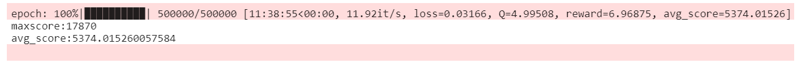

​		通过实验可知，JPCNN模型的平均分数为**5374.02**分，最高的一次分数为17870分。JPCNN模型相较于baseline模型，在平均分数和最高分数上都有一定的提升。训练好的模型位于`result/JPCNN/1.mge`，其中`result/JPCNN/`文件夹下的json文件记录了训练过程中`loss`和`avg_score`等数据的变化过程。

### 3.4 NaiveResNet

​		使用NaiveResNet替换baseline模型的实验结果截图，如下所示。

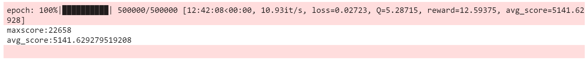

​		通过实验可知，NaiveResNet的平均分数为**5141.63**分，相较于JPCNN模型，虽然在平均分数上没有明显的提升，但是在最高分数上从JPCNN的17870分提升到了22658分，约提高了27%。训练好的模型位于`result/NaiveResNet/1.mge`。

### 3.5 NavjinNet

​		使用NavjinNet替换baseline模型的实验结果截图，如下所示。

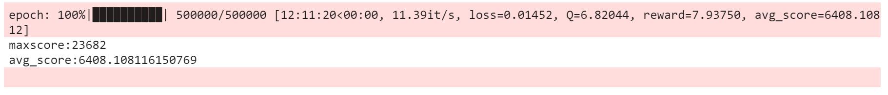

​		从实验结果可以看到，NavjinNet的平均分数达到了**6408.11**分，相较于前面的模型，在性能上有了明显的提升，最高分数也达到了23682分，是4个模型中效果最好的模型。训练好的模型位于`result/NavjinNet/1.mge`，其中`result/NavjinNet/`文件夹下的json文件记录了训练过程中`loss`和`avg_score`等数据的变化过程。
